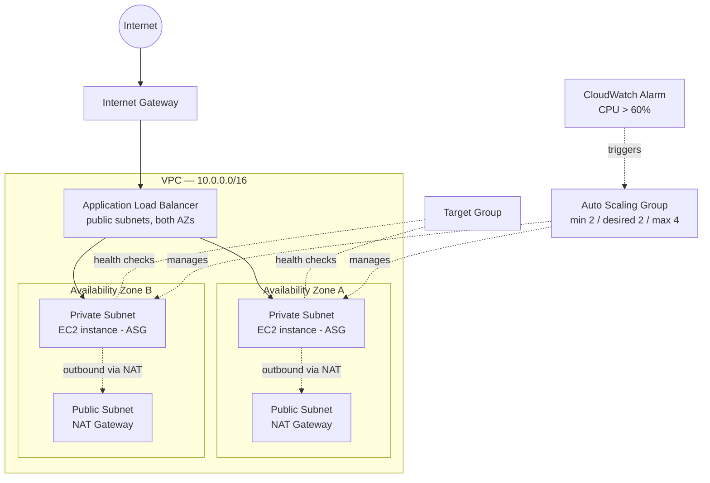
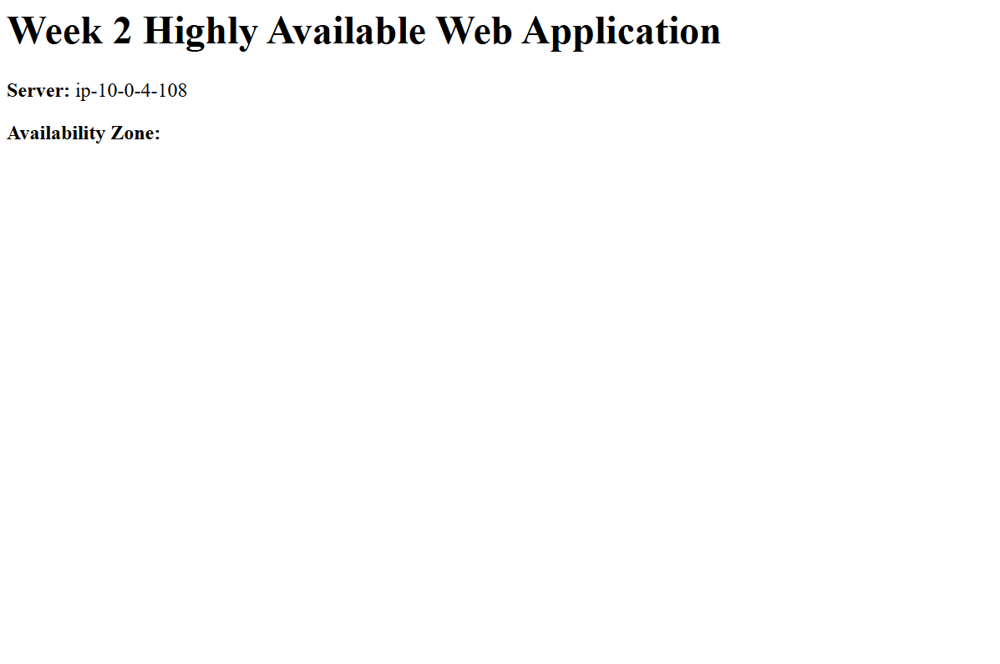
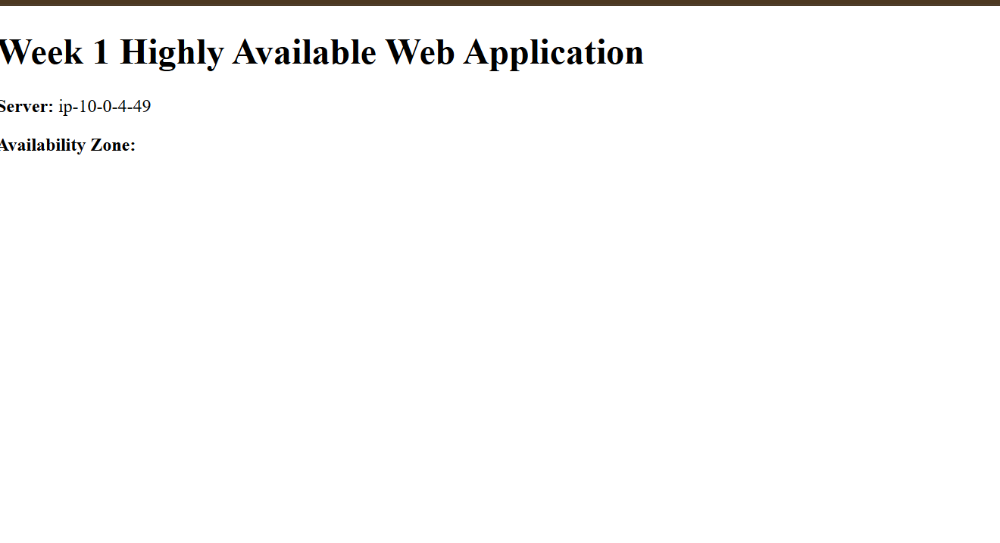
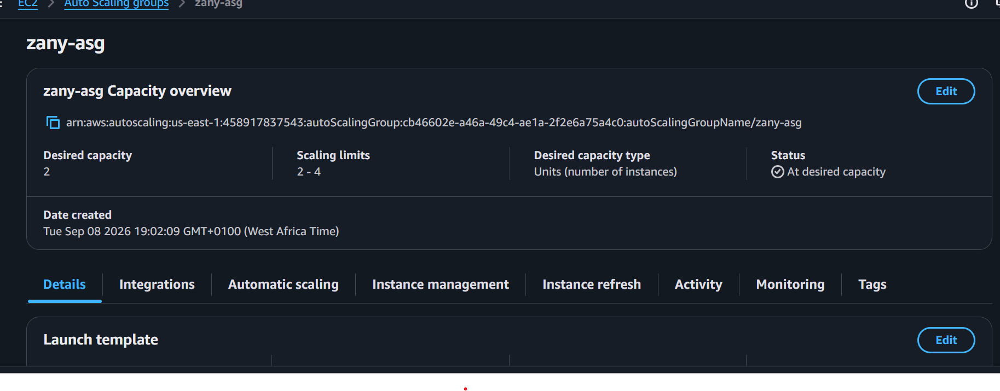
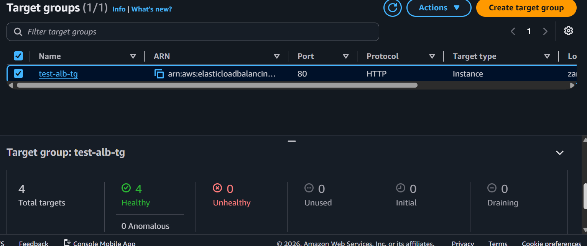

# Highly Available Web App on EC2 (ALB + Auto Scaling)

## Goal
Deploy a scalable, highly available web application behind an Application Load Balancer with Auto Scaling, mirroring a real production service.

## Architecture

**Flow:** Internet → Internet Gateway → Application Load Balancer (public subnets, spread across 2 AZs) → Target Group → EC2 instances (private subnets, spread across 2 AZs, managed by an Auto Scaling Group). Instances reach the internet outbound (for updates) through a NAT Gateway sitting in each AZ's public subnet. A CloudWatch alarm on average CPU utilization drives the ASG's scaling policy.

**Security groups:**
- `alb-sg` — inbound HTTP (80) from `0.0.0.0/0`
- `web-sg` — inbound HTTP (80) from `alb-sg` only (no direct internet access to instances)

## Screenshots
- ALB DNS test (curl output alternating between instance IDs)

   
   

- ASG activity log (instance termination + replacement event)

   
   

- Target Group health (both targets showing Healthy)

   

## What I Learned
Built a scalable, highly available architecture with redundancy and fault tolerance across two Availability Zones — but the real value was in understanding *why* each piece works the way it does:

- **EC2 status checks ≠ ASG health checks.** EC2 status checks only confirm the instance itself is alive (VM booted, OS responding) — they know nothing about whether the app on top is actually working. ELB health checks check the real thing (a response from `/`), so if nginx crashes but the instance is technically "running," ELB health checks catch it and the ASG replaces the instance — status checks alone would've missed it.
- **Security groups can reference other security groups, not just IP ranges.** Setting `web-sg`'s inbound rule to allow traffic from `alb-sg` (instead of a CIDR block) makes the rule identity-based rather than address-based — it doesn't matter what IP the ALB is using, anything with `alb-sg` attached is allowed in.
- **NAT Gateways + private subnets + Session Manager form a complete pattern.** No public IP means nothing inbound from the internet, but the NAT Gateway still allows outbound access (updates, etc.). Session Manager then gives a way *in* without opening port 22 at all, using an IAM role instead of network access — outbound open, inbound closed, entry controlled through IAM rather than the network.

## Issues Faced
- **Target Group not picking up instances:** ran into trouble getting my EC2 instances attached to the Target Group. Resolved by working through the registration flow properly (the instances need to be explicitly registered as targets — the ALB doesn't discover them automatically).
- **Couldn't connect to the ALB DNS name:** was testing over HTTPS while the ALB listener was only configured for HTTP (port 80). Fixed by using `http://` instead of `https://` when testing the DNS name.

